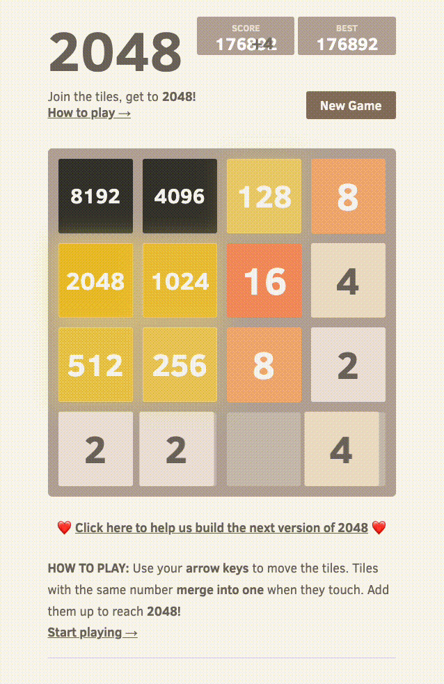

# Optimal2048 - Expectimax 2048 AI in C#

This project is an efficient C# implementation of the Expectimax search algorithm for the popular puzzle game **2048**.

The AI consistently reaches the **8192 tile**, and often reaches the **16384 tile**.

## Demo (slowed)

