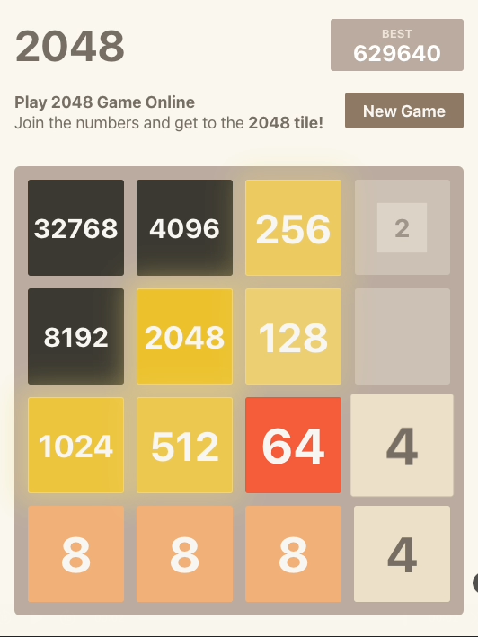

# Optimal2048 - Expectimax 2048 AI in C#

This project is an efficient C# implementation of the Expectimax search algorithm for the popular puzzle game **2048**.

The AI consistently reaches the **8192 tile**, and often reaches the **16384 tile**.

## Highest Score

## Features

- **64 bit integer** board representation, where each tile is represented as a power of 2 using **4 bits**
- Board manipulations are handled using **bitwise and shift operations** for efficiency
- Moves and heuristic evaluations are performed using **pre-computed lookup tables** to avoid heavy calculations at runtime
- The AI uses an **sophisticated heuristic function** to evaluate a board state, which combines:
  - Rewards for maximising the number of **empty tiles** and **possible merges**
  - Penalties for disrupting **monotonicity** (ensuring adjacent tiles increase or decrease smoothly)
- **Expectimax search algorithm** to identify optimal moves under probabilistic outcomes. The search is **paralellised** over the first move
- The AI dynamically adjusts its **search depth** (typically 6-8 levels in the middle to late game) based on the criticality of the board state. Average search time in the middle to late game is **200-400ms** per move
- The AI connects to [2048game.com](https://2048game.com) using **Selenium WebDriver** to play online

## Demo (slowed)

